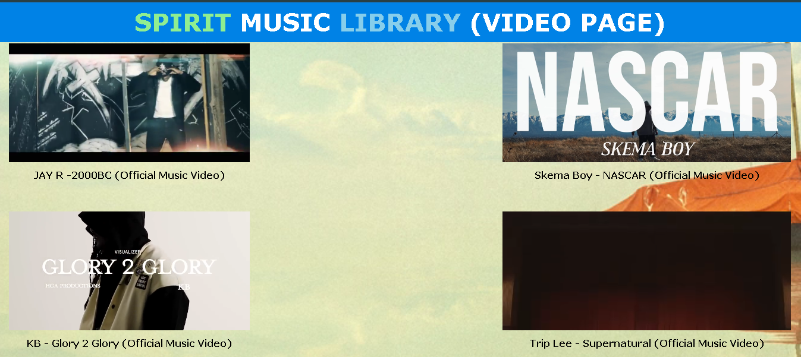

### README.md for Spirit Music Library Website 🎶🎧

---

# Spirit Music Library Website 🎼🎤

Welcome to **Spirit Music Library Website**! 🎉 This project is a comprehensive platform for music enthusiasts, providing a delightful mix of audio tracks and music videos. 🎵 Whether you're a fan of soothing melodies 🎶 or energetic beats 🥁, Spirit Music Library has something for everyone. Explore our vast collection, discover new favorites 🌟, and immerse yourself in the world of music! 🎧


## Table of Contents 📜

1. [Overview](#overview)
2. [Features](#features)
3. [Installation](#installation)
4. [Usage](#usage)
5. [Contributing](#contributing)
6. [License](#license)
7. [Contact](#contact)

## Overview 📖

Spirit Music Library is designed to be a user-friendly and visually appealing platform 🎨 where users can listen to music 🎵 and watch videos 🎥 effortlessly. The project is built using HTML5, CSS3, and includes a responsive design 📱 to ensure an optimal viewing experience on all devices.

## Features ✨

- **Responsive Design** 📱💻: Enjoy seamless access across desktops, tablets, and mobile devices.
- **Audio and Video Playback** 🎶🎥: Listen to your favorite tracks and watch music videos in high quality.
- **User-Friendly Navigation** 🚀: Easily navigate through different sections of the site.
- **Stylish UI** 🎨: A clean and modern interface that enhances the user experience.

## Installation 🛠️

To get a local copy up and running, follow these simple steps:

1. **Clone the Repository**:
   ```sh
   git clone https://github.com/King-Greatman-Spirit/Spirit_Music_Library.git
   ```
2. **Navigate to the Project Directory**:
   ```sh
   cd Spirit_Music_Library
   ```
3. **Open `home.html` in your Browser**:
   Simply open the `home.html` file in your favorite web browser 🌐 to explore the site.

## Usage 🎸

- **Home Page** 🏠: Start your journey at the home page, where you can find featured audio tracks and music videos.
- **Audio Section** 🎵: Dive into our audio library and enjoy a variety of tracks.
- **Video Section** 🎥: Watch the latest music videos and enjoy visual performances.

### Screenshot 📸


[Login Form](./image/form.png)
[Home Page View](./image/home.png)
[Audio Page View](./image/audio.png)
[Video Page View](./image/video1.png)

## Contributing 🤝

We welcome contributions to enhance Spirit Music Library! 🛠️ Here's how you can get involved:

1. **Fork the Project** 🍴: Click on the 'Fork' button on the top right corner of this repository.
2. **Create a New Branch** 🌿: Use `git checkout -b feature/YourFeatureName` to create a new branch.
3. **Commit Your Changes** 💾: Make your changes and use `git commit -m 'Add a feature'` to commit them.
4. **Push to Your Branch** 🚀: Use `git push origin feature/YourFeatureName` to push your changes.
5. **Open a Pull Request** 📬: Submit a pull request to the `main` branch of this repository.

## License 📄

This project is licensed under the MIT License. See the [LICENSE](LICENSE) file for more details.
"D:\FLOWCODE\music"
## Contact 📧

- **Developer**: King Greatman Justus
- **Email**: [spiritpydev@gmail.com](mailto:spiritpydev@gmail.com)
- **GitHub**: [King-Greatman-Spirit](https://github.com/King-Greatman-Spirit)
- **LinkedIn**: [King Greatman Spirit](https://linkedin.com/in/greatman-pydev)

Thank you for visiting Spirit Music Library! 🎉 If you enjoy the project, please give it a star ⭐ on GitHub. Your feedback and contributions are always welcome. Let's make music accessible to everyone! 🎶🌍
